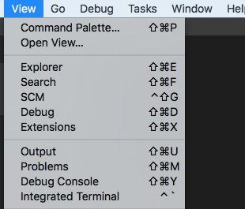
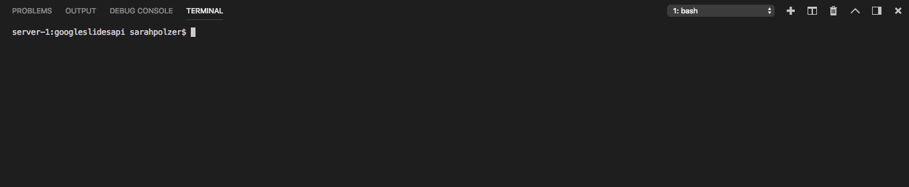
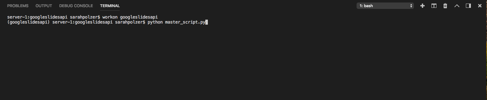
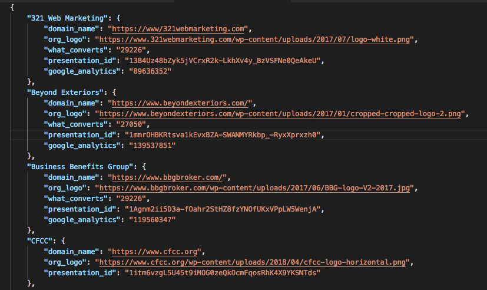
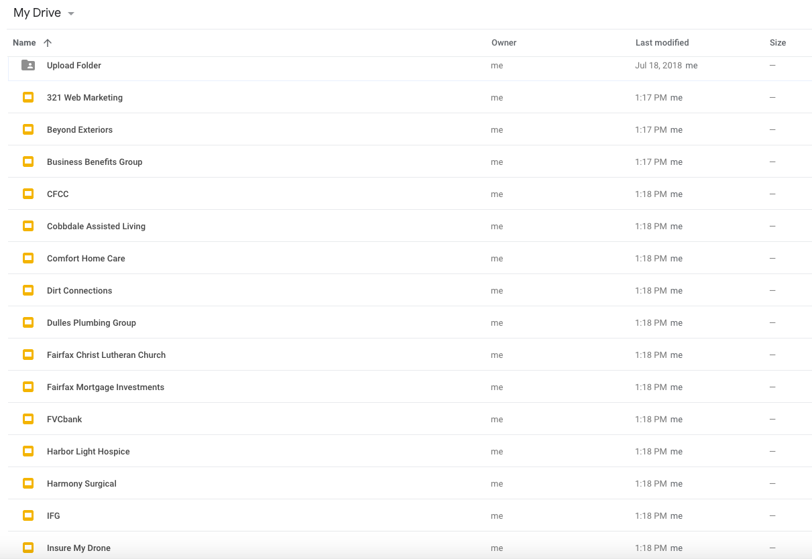
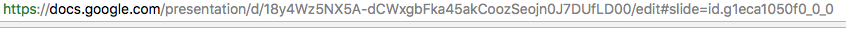

# Report Automation Documentation :star:

_Welcome Folks!_ The purpose of this project is to automate the monthly reports. 

## Why Report Automation?

 At 321 we have a lot of clients. Every month, we generate a report for each of our clients. This was previously laboriously completed by people like Steve, who would sift through ahrefs and Google Analytics to get screenshots of charts. But no longer! 

### Templates 

All reports will be based off of a template presentation. The template presentation will be comprised of shapes and bracketed words that will be found by the API and replaced with charts, images, times, and other words. Here is what the first slide of the template presentation will look like.

## Google APIs

It is important to note that we will be working with the Google Slides, Google Drive, and Google Analytics APIs. This can be complicated. Before you begin it is important that the template presentation, the client presentations (optional), and google analytics client pages be shared with your email with certain permissions. Talk to Jonathan, Elijah, or Anthony about gaining access to these before you begin.

## How to Run Code

In a very general way. There are template reports made for every single client with information in the file 
client_information/client_information.json. These reports should be shared with you on Google Slides. You should be logged into a google
account and be inside of my virtual environment (requirements.txt). Great, so now open up a separate terminal using finder. The terminal icon looks like this

The terminal should look like this

Make sure you are in the correct directory. For me that looks like ~/dev/googleslidesapi. You can change your directory by typing in cd and then your file path. So, I would type in cd ~/dev/googleslides api to get to my project located at Users/sarahpolzer/dev/googleslidesapi. 

Then I would make sure that I am in a virtual environment with all of the necessary packages, if pip, virtualenv,virtualenvwrapper are already installed on your computer, type in mkvirtuaenv googleslidesapi.

Then type in workon googleslidesapi

Finally, type in pip install -r requirements.txt. Great, you should be ready. 

In the separate terminal, type in python flask_master_script.py, and follow directions for User inputs.

Wait a couple seconds. The separate terminal should now look like this. Leave it alone for now.

Now go to VSCode in the project folder. At the top of the page, you should see a dropdown entitled View. Click on it and then press integrated terminal. 

The integrated terminal looks like this.

 Make sure you are in the correct directory, and that you are in the correct virtual environment (type workon googleslidesapi). Ok now type into the integrated terminal python master_script.py.

The code should run and you should see that the report for the client that you selected will be automated with charts, dates, logos, and more!!

## How to regenerate client template reports and update client information

Ok cool so located in the client_information directory ~/dev/googleslidesapi/client_data_list there is a script to generate client data and new template reports named after each client. There is a file called client_information.json that contains a clients dictionary. This dictionary has client names, and domain names, google analytics ids, what converts ids, organization logos, presentation ids. If you need to update any of these values just go into the file and update it. Here  is a sample of json client data.

 If you need to generate completely new template client reports, move the file client_data_list.py into the main (~/dev/googleslides) directory, delete the file client_information.json, and then run client_data_list.py by typing python client_data_list.py into the terminal. A new client dictionary (client_information.json) and new client template reports (located in google drive) will be generated. 

  After this process has completed, drag client_data_list.py and client_information.json into the client_information folder once more :star:

 ### Updating presentation IDs.

 Lets say that you want to make a new template report for a client without having to make template presentations for all clients by running client_data_list.py. Theres an easy solution. Just make a copy of the google presentation in your drive entitled template, and then rename it the name of the client. Then find its presentation id based on the presentations URL.

Above is a google presentations url. presentation/d/ and /edit is a long sequence of letters and numbers. This is your presentation ID. Copy this sequence, and paste it into client_information.json next to "presentation_id": for the client. Make sure it is a string, or is enclosed by quotations. For example "presentation_id" : "18y4Wz5NX5A-dCWxgbFka45akCoozSeojn0J7DUfLD00"

### Updating Domain Name, WhatConvers, Organization Logo, or Google Analytics Information for a Single Client

The same can be done if the organization logo, the WhatConverts ID, the domain name, or the Google Analytics ID of any one client changes. Just overwrite the old inforamtion in client_information.json with new client information. For example, if client_information.json says that the domain name for Beyond Exteriors is beyond_exteriors.org like this "Beyond Exteriors" : "beyond_exteriors.org", and the domain name has been changed to "beyond_exteriors.com", just overwrite the old dictionary value with "beyond_exteriors.com". 

"Beyond Exteriors" : "beyond_exteriors.org" is now "Beyond Exteriors" : "beyond_exteriors.com"

